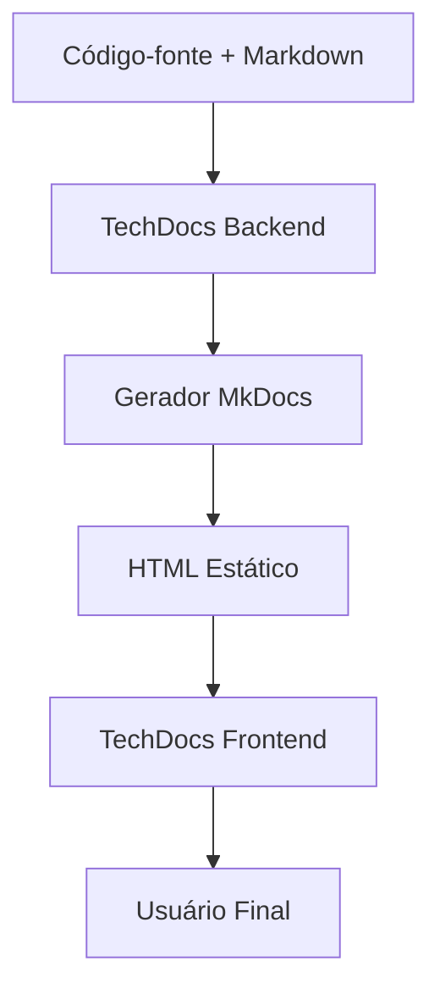

# Arquitetura

## Visão Geral

A arquitetura do TechDocs é composta por três partes principais:

1. **TechDocs Frontend**: Responsável por renderizar a documentação no Backstage
2. **TechDocs Backend**: Serviço que gerencia a geração e publicação de documentação
3. **Geradores de Documentação**: Ferramentas como MkDocs que transformam markdown em HTML

## Fluxo de Geração

Quando a documentação é solicitada, o seguinte fluxo ocorre:

1. O TechDocs Backend clona o repositório (ou lê os arquivos locais)
2. O gerador (MkDocs) é executado para transformar markdown em HTML
3. Os arquivos HTML são publicados em um armazenamento (local ou em nuvem)
4. O TechDocs Frontend renderiza a documentação a partir do armazenamento
